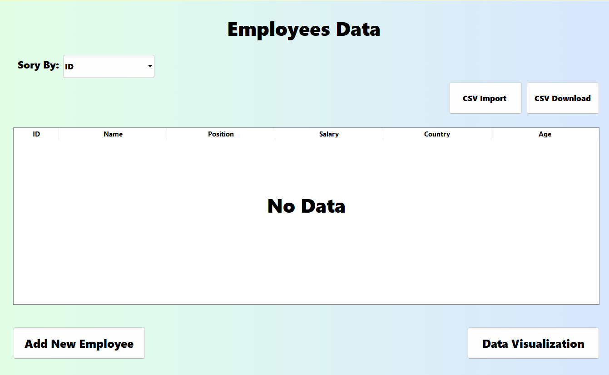
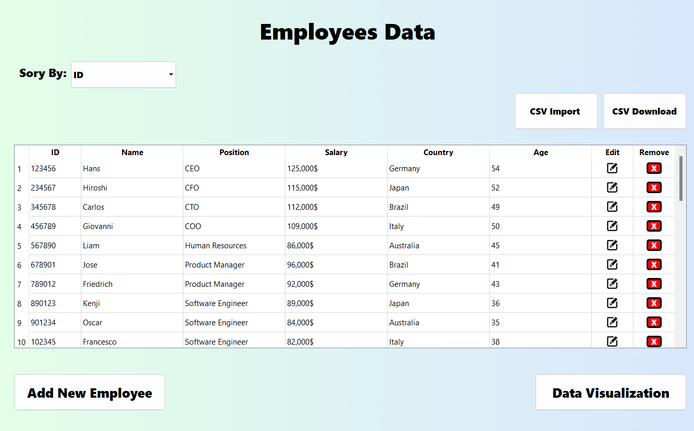
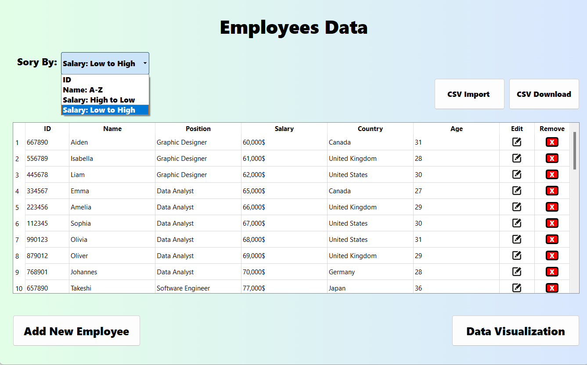
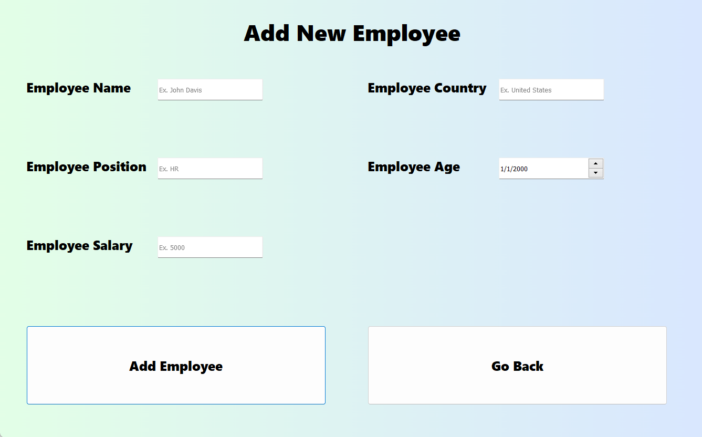
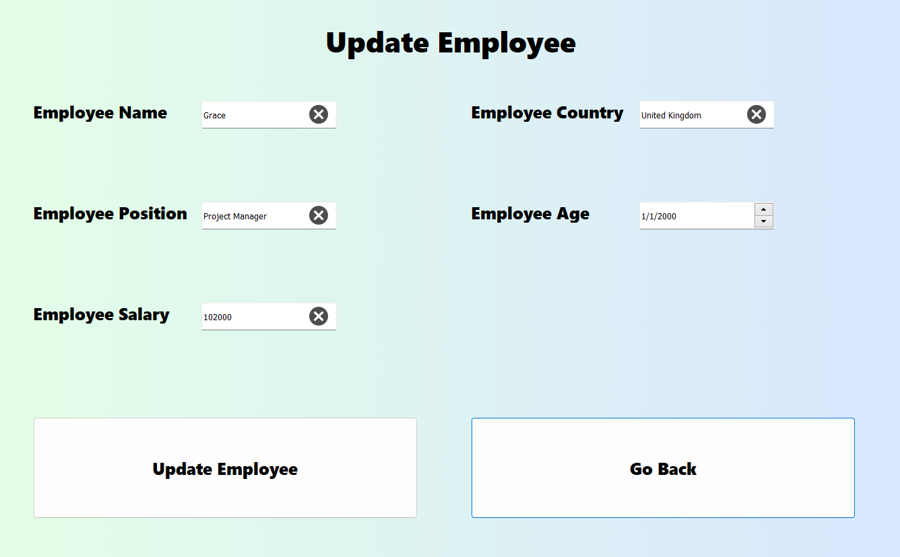
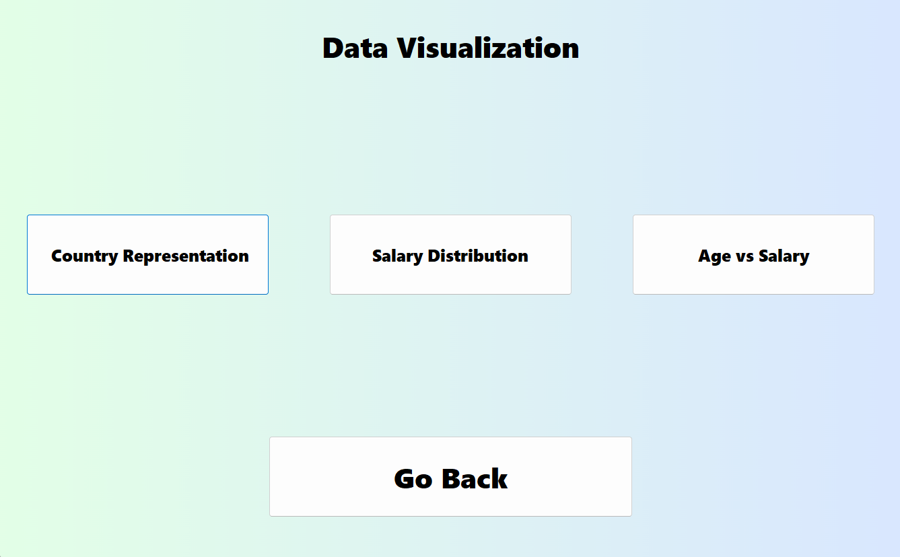

## Setup 

- Install the dependencies following these steps : 

  - <>Code > Download ZIP > Open cmd/terminal in that location
  - Run these commands:
    - `pip install virtualenv`
    - `virtualenv venv`
    - `venv\Scripts\activate`
    - `pip install -r requirements.txt`

## Screenshots

### Employees Dashboard

### Employees Dashboard With Fake Data

### Sorting Feature 

### Add New Employee Dashboard

### Update Existing Employee Dashboard

### Data Visualization Feature

### Country Representation

### Salary Representation

### Age Vs Salary Representation
