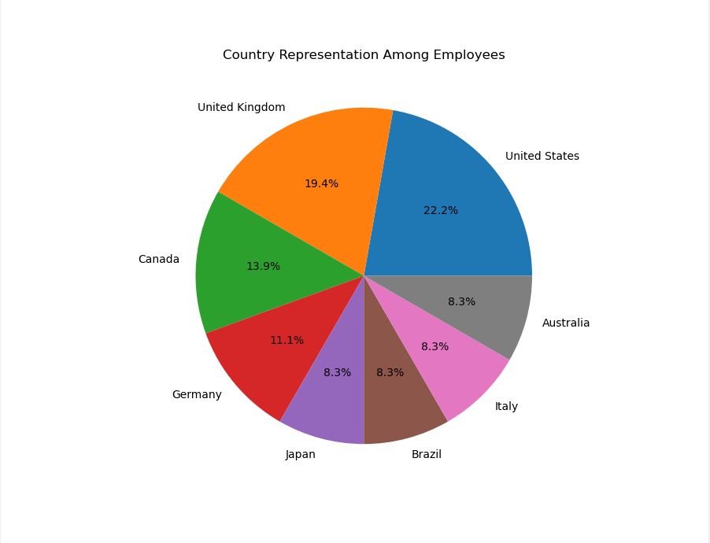
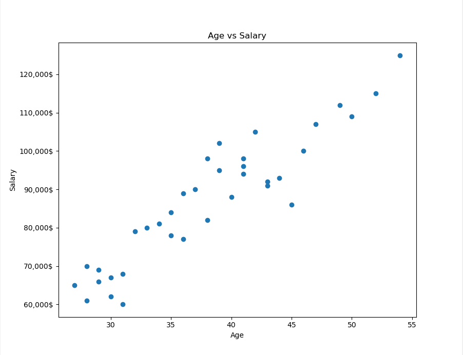

# Table of Contents
- [About The Project](#about-the-project)
  - [Project Title](#project-title)
  - [Description](#description)
  - [Built With](#built-with)
  - [Project Tree Structure](#project-tree-structure)
- [Visuals](#visuals)
- [Features](#features)
- [Installation](#installation)
- [Contact](#contact)


# About The Project


## Project Title
**Employee Management System**


## Description
This project involves the development of an advanced Employee Management System (EMS) with a graphical user interface (GUI) leveraging the capabilities of Python programming language and the PyQt5 library. The project aims to streamline and enhance operational efficiency for businesses by providing a comprehensive dashboard for managing employee data.

The dashboard prominently features fields for Employee ID, Name, Position, Salary, Country, and Age. The EMS allows companies to perform a variety of actions such as view employee profiles, add new employee data, update existing employee information, and remove employee profiles as necessary. A unique functionality of this system is the ability to sort employees based on criteria such as their ID, name, or salary, thus offering greater convenience and efficiency in data handling.

Furthermore, this project incorporates a CSV functionality where users can import employee data from, or download data to, CSV files. This feature significantly reduces the data transfer time and ensures smooth interoperability with other software systems.

In addition, the GUI provides robust data visualization capabilities. It includes Country Representation, which displays the geographical distribution of employees; Salary Representation, illustrating salary dispersion; and Age vs. Salary Representation, providing insight into the correlation between an employee's age and their salary. These visualizations offer valuable data-driven insights to the management, facilitating strategic decision-making.

In conclusion, this Python project featuring a PyQt5 GUI is a powerful tool for companies to manage their employee data efficiently, perform necessary administrative tasks, and derive strategic insights from their human resources data.

## Built With
* 
  * 
  * 
  * 


## Project Tree Structure
```
EmployeesSystem
├───Screenshots
└───src
    ├───assets
    └───data
   ```


# Visuals
**Employees Dashboard**


**Employees Dashboard With Fake Data**


**Sorting Feature**


**Add New Employee Dashboard**


**Update Existing Employee Dashboard**


**Data Visualization Feature**


**Country Representation**


**Salary Representation**


**Age Vs Salary Representation**



# Features
* **Intuitive Dashboard for Employee Data**

  The Graphical User Interface (GUI) features a comprehensive and user-friendly dashboard that presents all essential employee information, including Employee ID, Name, Position, Salary, Country, and Age. The dashboard's design facilitates easy understanding and navigation, ensuring smooth interaction for users.

* **CRUD Operations**

  The GUI incorporates the Create, Read, Update, and Delete (CRUD) operations, thereby providing complete control over the employee data management. Users can easily add new employees (Create), view the existing employee information (Read), modify the details of existing employees (Update), and remove employee profiles from the system (Delete). This functionality forms the core of the management system and enables efficient data management.

* **Advanced Sorting**
  
  The GUI provides an advanced sorting feature, which allows users to sort employee data based on Employee ID, Name, or Salary. This feature enables users to order the data as per their preference, aiding in easy access and analysis of the employee data.

* **CSV Data Import/Export**
  
  The GUI includes a feature for importing and exporting employee data using CSV files. Users can effortlessly import data from a CSV file to the system or export the employee data into a CSV file. This feature provides a seamless connection with other software systems and facilitates smooth data transfer.

* **Data Visualization**
  
  The GUI offers robust data visualization tools that include Country Representation, Salary Representation, and Age vs. Salary Representation. These visualizations help in analyzing and understanding complex data patterns and trends, supporting strategic decision-making. These tools enable users to gain meaningful insights from their data and to make informed decisions.
  

# Installation
- Install the dependencies following these steps : 

  - <>Code > Download ZIP > Open cmd/terminal in that location
  - Run these commands:
    - `pip install virtualenv`
    - `virtualenv venv`
    - `venv\Scripts\activate`
    - `pip install -r requirements.txt`
    
# Contact
[](mailto:Ziyad.M.Aljaser@gmail.com)
[](https://www.linkedin.com/in/ziyad-aljaser/)
[](https://github.com/Ziyad-Aljaser)
